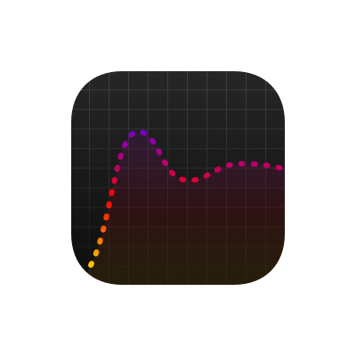
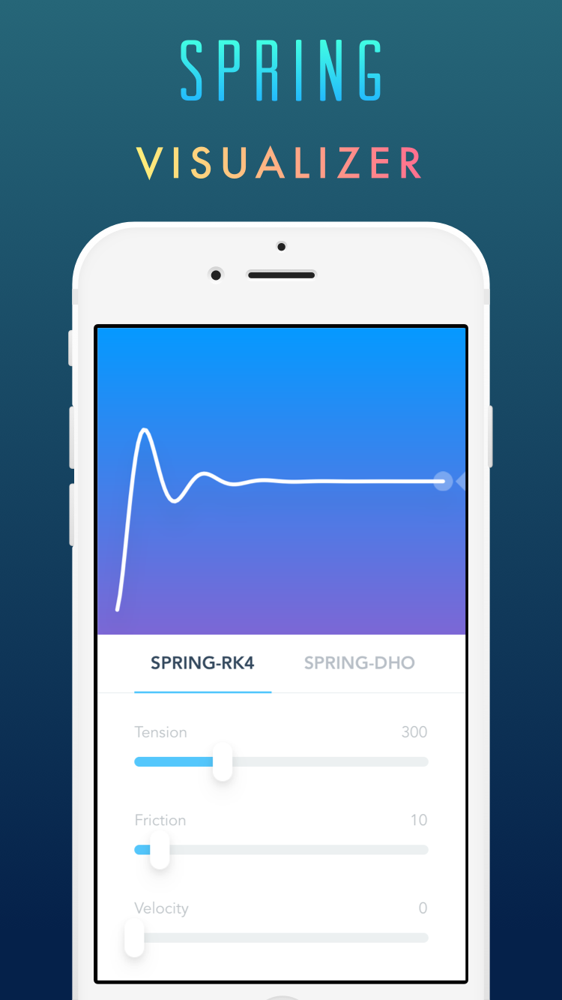
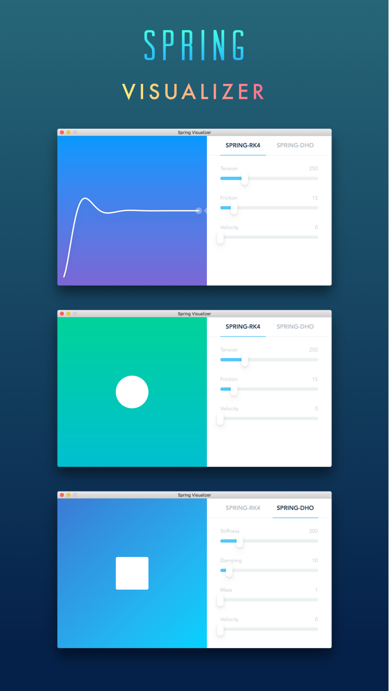

<h1 align="center">Spring Visualizer</h1>
<p align="center">Spring Animation Curve Visualizer</p>

<br>

	This project mainly show you how i built iOS App & macOS App using FramerStudio, Xcode and Gulp.

<br>

Spring Visualizer 2.0 | Spring Visualizer Legacy| Spring Visualizer for Mac
:---:|:---:|:---:
||
<br>[**[App Store]**](https://itunes.apple.com/app/id1143244115)<br><br>|<br>[**[App Store]**](https://itunes.apple.com/app/id1139500914)<br><br>|<br>[**[Mac App Store]**](https://itunes.apple.com/app/id1163478394) / [**[Zip]**](https://github.com/RayPS/Spring-Visualizer/releases)<br><br>
||


# How to run

First for all, you need to install all dependencies.

	$ npm install

Then
	
	$ gulp

Open `project.framer` in FramerStudio, you might want to edit or preview the framer project.

Hit `⌘+S` when you're done.

Open `Spring Visualizer App.xcodeproj` in Xcode.

Hit `⌘+R` to run the App in Simulator,

if you don't see the Mac App scheme, just add a new scheme:


# How it works


Gulp will keep watching `app.coffee`

After `app.cofee` modified in FramerStudio or any text editor,

the necessary files will copy to `HTML/`

Then use **WKWebView** to load `HTML/index.html`


> ViewController.swift

```swift
override func viewDidLoad() {
    super.viewDidLoad()
    
    let webView = WKWebView(frame: view.frame)
    view.addSubview(webView)
    webView.backgroundColor = view.backgroundColor
    
    let path = Bundle.main.path(forResource: "index", ofType: "html", inDirectory: "HTML")!
    let url = URL(fileURLWithPath: path)
    
    webView.loadFileURL(url, allowingReadAccessTo: url)
    webView.scrollView.bounces = false
}
```

# Known issues

I don't know how to disable bounce scrolling for **WKWebView** in macOS,
`WKWebView.scrollView` is [documented](https://developer.apple.com/reference/webkit/wkwebview) but not found in Cocoa.

If you got any idea, please send pull request or open an [issues](https://github.com/RayPS/Spring-Visualizer/issues) to let me know!

# Conclutions

Everytime i show my Framer prototypes to my friends they never relize that was a prototype, even i told them that was just a prototype they still don't believe. It works smoothly just like a real App. In a certain sense prototypes is now productions, we have `Utils.domLoadDataSync` to access any APIs, for example here is a very simple [Dribbble Client](http://share.framerjs.com/2a7rusw6qg4u/) i made in Framer. Thanks to Webkit!

Hey designers, go make your ideas come true! :)